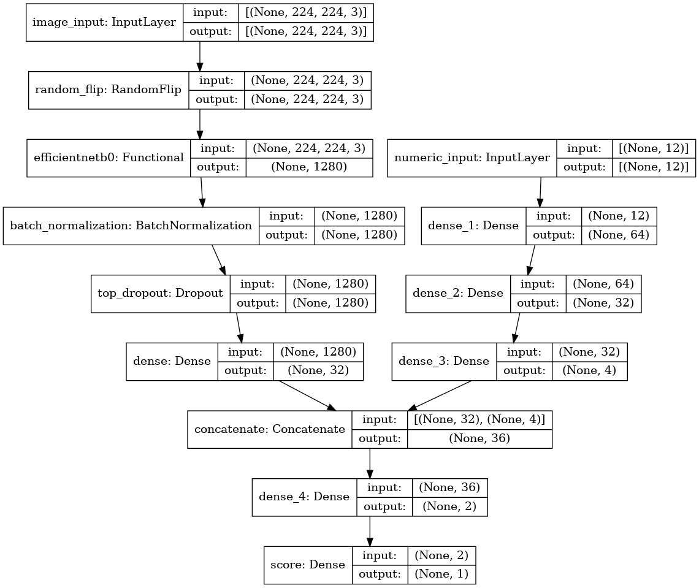

# PetFinder.my - Pawpularity Contest

In this project, I share my solution for Kaggle competition [PetFinder.my - Pawpularity Contest](https://www.kaggle.com/c/petfinder-pawpularity-score).
Given images of pets and images metadata, the purpose of the contest is to predict popularity of pets. High popularity means that the pet have high chances to be adopted.

## Multiple input keras model
I have used a pretrained image classification model EfficientNetB0 for input images and three dense layers for numeric input.

